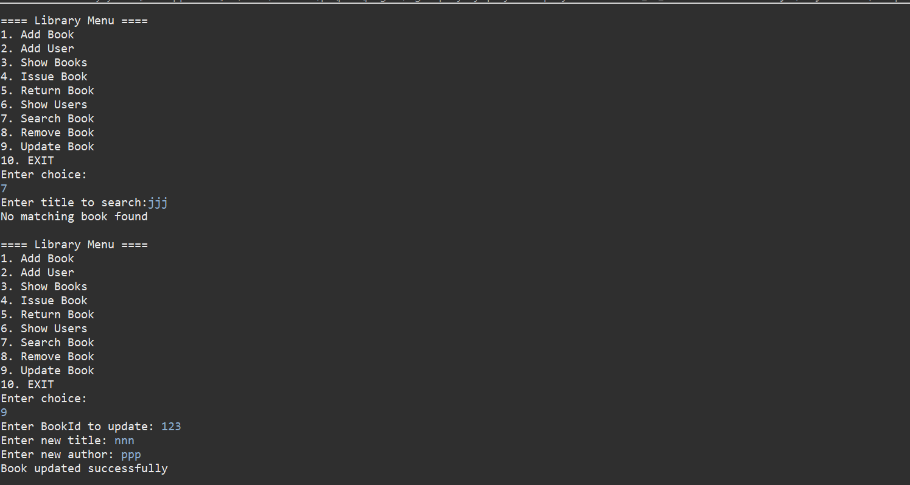
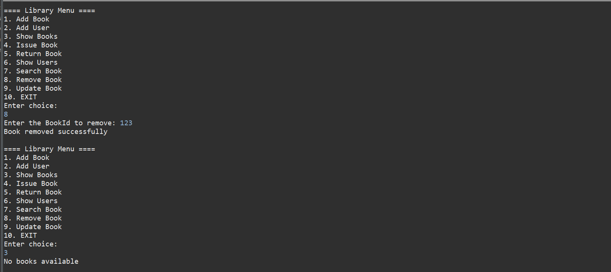
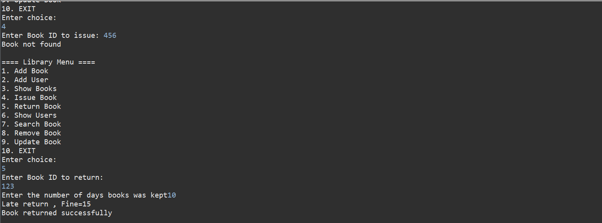
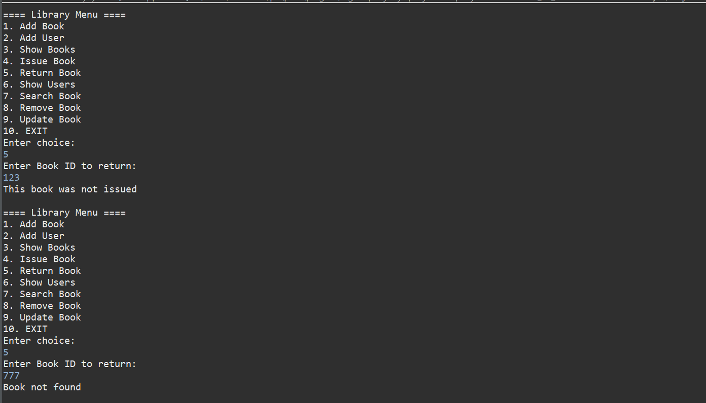
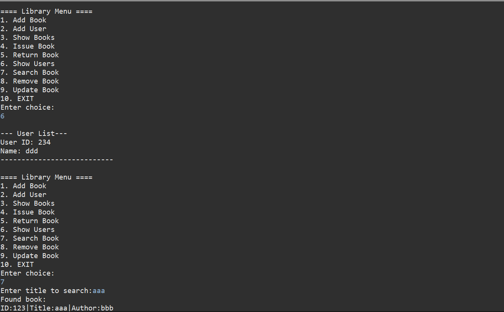
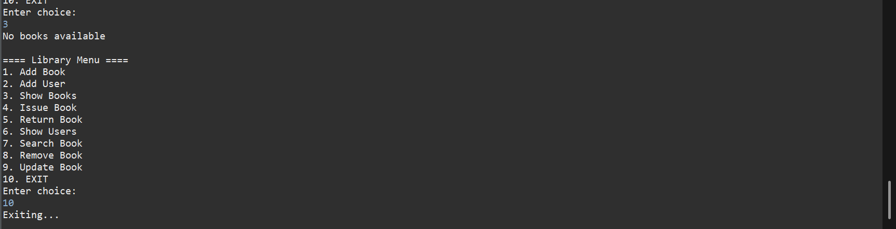

# Library Management System (Java)

##  Description
This is a console-based Library Management System developed using Core Java. 
It helps manage books and users, issue and return books, and calculate fines for late returns.

---

##  Features
- Add Books
- Add Users
- Remove Books
- Update Book Details
- Search Books
- Issue Book
- Return Book with Fine Calculation
- View Books
- View Users

---

##  Concepts Used
- OOP (Classes & Objects)
- ArrayList
- Loops & Conditions
- Methods
- User Input (Scanner)

---

##  Tools Used
- Java (Core Java)
- Eclipse IDE
- GitHub

---

##  How to Run
1. Open the project in Eclipse IDE
2. Run `LibrarySystem.java`
3. Use menu options to perform operations

---

## Sample Output
## Screenshots

### Add Book & User

### Show Books

### Update Book

### Show Updated Books

### Remove Book

### Issue Book

### Return Book

### Search Book / Show Users

### Exit

